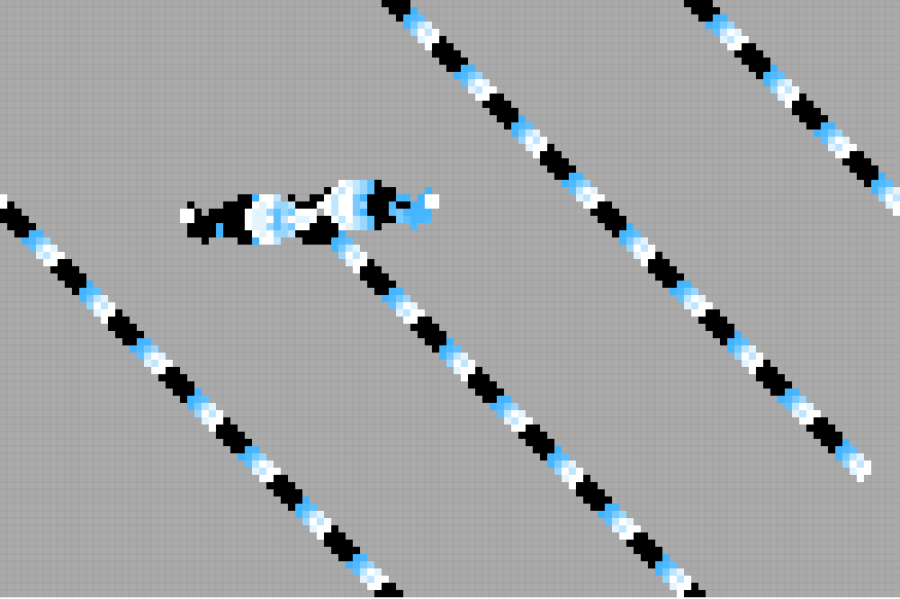
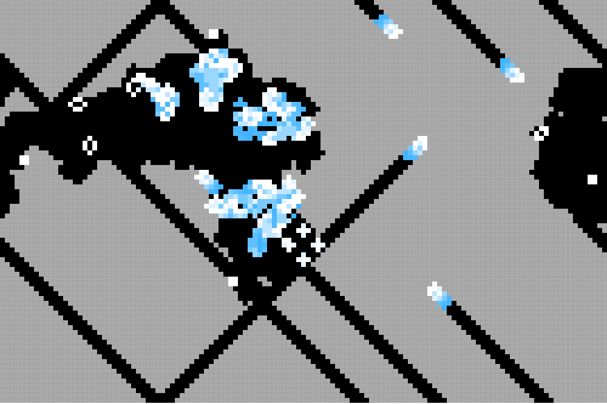

# Wp Game Of Life

A game of life simulation using HTML5 canvas. For more information visit the [Game of Life Wiki Page](http://en.wikipedia.org/wiki/Conway's_Game_of_Life). Not very useful except for entertainment purposes. [Demo](http://vilmosioo.co.uk/project/game-of-life/)

## Shortcodes

`[gol ID='canvas_id' width='width' cells='cells' background='background' cell_active_color='cell_active_color' cell_inactive_color='cell_inactive_color' cell_transition_color='cell_transition_color']`

Embeds a game of life animation in your post. Parameters:

 * `canvas_id` (optional) The id of the generated canvas. Default: *WP_GAME_OF_LIFE*
 * `width` (optional) The desired width of the generated canvas. Will not expand beyond the viewport. Default: *1000*
 * `cells` (optional) The number of cells in one row to draw. This affects performance exponantioly. Use with caution. Default: *125*
 * `background` (optional) The background color of the generated canvas. Default: *#aaa*
 * `cell_active_color` (optional) The color of active cells. Default: *#fff*
 * `cell_inactive_color` (optional) The color of inactive cells. Default: *#000*
 * `cell_transition_color` (optional) The color of cells that have just been deactivated. Must be rgb format. Default: *rgb(65,180,255)*

## Contribute!

If you have suggestions for a new add-on, feel free to contact me on [Twitter](https://twitter.com/vilmosioo)!

## Installation
1. Download the dist folder, rename it *to game-of-life* and upload it to your */wp-content/plugins/* directory.
2. Activate the plugin through the *Plugins* menu in WordPress
3. Ready to go! Now you can use the [gol] shortcode within your theme.

## Screenshots

Glidergun pattern in game of life.

 

Pentomino pattern in game of life.

 

## Changelog

### 0.0.1
 * Launched first version.
 * Will inject a canvas tag in the document and create a game of life animation.